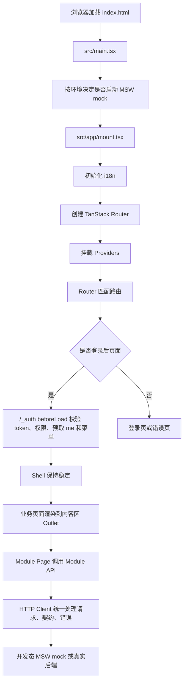

# 前端架构指导手册

本文面向第一次接触本项目的人。目标不是背概念，而是让你读完后能回答四个问题：

1. 这套前端用了哪些技术，它们各自负责什么。
2. 浏览器打开系统后，代码从哪里开始执行，如何一步步启动。
3. 关键文件分别管什么，哪些地方不能乱放逻辑。
4. 后续新增页面、接口、子系统、主题能力时，应该从哪里介入。

如果你只想看约束清单，读 `docs/architecture.md`。本文是解释型手册，讲系统为什么这样组织，以及模块之间如何串联。

## 1. 系统一句话理解

这是一个基于 Vite + React + TypeScript 的后台管理脚手架。

它的核心思路是：

- `src/main.tsx` 只负责启动。
- `src/app` 负责应用级装配和登录后的 Shell。
- `src/routes` 负责 URL、权限元数据和路由边界。
- `src/modules` 负责业务子系统、业务页面、接口和 mock。
- `src/lib/http` 负责统一请求和接口契约。
- `src/config` 负责环境、默认路由、请求策略、功能开关和外观默认值。
- `src/stores` 只放客户端状态，例如 token、主题、布局、侧边栏折叠。
- 服务端数据统一交给 TanStack Query，不复制到 Zustand。

从浏览器视角看，系统大致这样运行：



## 2. 技术栈

### 2.1 构建与基础语言

| 技术 | 作用 | 关键文件 |
| --- | --- | --- |
| Vite | 开发服务器、生产构建、插件系统 | `vite.config.ts` |
| TypeScript | 类型系统，约束组件、接口、路由和配置 | `tsconfig*.json` |
| React 19 | UI 渲染和组件模型 | `src/**/*.tsx` |
| pnpm | 包管理器和脚本执行 | `package.json`、`pnpm-lock.yaml` |

Vite 插件里有三个关键点：

- `@vitejs/plugin-react`：让 Vite 支持 React。
- `@tailwindcss/vite`：接入 Tailwind CSS v4。
- `@tanstack/router-plugin/vite`：根据 `src/routes` 生成 `src/routeTree.gen.ts`，支撑文件路由和自动拆包。

另外还有一个本项目自定义插件 `stripMockWorkerPlugin`，生产构建时会移除 `dist/mockServiceWorker.js`，避免 mock worker 误进生产产物。

### 2.2 路由、数据和状态

| 技术 | 负责什么 | 本项目用法 |
| --- | --- | --- |
| TanStack Router | 前端路由、search 参数校验、路由 loader、权限元数据 | `src/routes` |
| TanStack Query | 服务端数据缓存、请求状态、失效刷新 | `src/app/query.ts`、`src/modules/*/api` |
| Zustand | 纯客户端全局状态 | `src/stores/auth.ts`、`src/stores/appearance.ts` |
| Zod | 运行时数据校验 | `src/config/env.ts`、`src/lib/http/contract.ts`、`src/modules/*/api` |

这里最重要的分工：

- URL 状态放 TanStack Router search，比如成员列表的页码、部门筛选、角色页当前 roleId。
- 服务端数据放 TanStack Query，比如用户列表、角色列表、菜单树、当前用户信息。
- 客户端偏好放 Zustand，比如 token、主题、布局、显示比例、侧边栏折叠。
- 页面瞬时交互状态放组件内部，比如弹窗是否打开、当前 tab、当前详情对象。

不要把服务端列表复制到 Zustand 里维护第二份数据。这会让缓存、刷新、权限和接口状态全部变复杂。

### 2.3 UI、样式和交互

| 技术 | 作用 | 关键位置 |
| --- | --- | --- |
| Tailwind CSS v4 | 样式工具类和 token 映射 | `src/styles/global.css` |
| shadcn/ui + Radix | 基础 UI 原语，例如 Dialog、Tooltip、Select | `src/components/ui` |
| `components/pro` | 后台通用业务无关组件 | `src/components/pro` |
| lucide-react | 图标库 | `src/lib/icon-registry.tsx`、各组件 |
| sonner | 全局 Toast | `src/app/providers.tsx` |
| i18next/react-i18next | 多语言文案 | `src/locales`、`src/lib/i18n.ts` |

本项目视觉体系不靠硬编码颜色，而靠 CSS 变量：

- 颜色 token 在 `src/styles/tokens.css`。
- Tailwind token 映射在 `src/styles/global.css`。
- 用户切换主题、布局、显示比例时，由 `src/stores/appearance.ts` 和 `src/lib/appearance-dom.ts` 写入 DOM。
- 显示比例统一用 `--app-scale` 乘法，不使用 CSS `zoom`。

### 2.4 Mock、测试和质量门禁

| 技术 | 作用 | 关键位置 |
| --- | --- | --- |
| MSW | 开发态 mock API | `src/mocks`、`src/modules/*/mocks` |
| Vitest | 单元测试和边界测试 | `src/**/*.test.ts(x)` |
| Testing Library | React 组件测试 | 组件测试文件 |
| ESLint | 代码质量检查 | `eslint.config.js` |

开发态默认启用 mock。生产构建默认关闭 mock，并通过构建检查确保 MSW/faker 不进入生产包。

## 3. 项目入口与启动流程

### 3.1 浏览器入口

浏览器先加载根目录的 `index.html`。其中真正的应用入口是：

```text
src/main.tsx
```

`main.tsx` 做两件事：

1. 调用 `startMockWorkerIfEnabled()`，按环境决定是否启动 MSW。
2. 懒加载 `src/app/mount.tsx`，再调用 `mountApp()` 挂载 React 应用。

为什么要先处理 mock 再挂载应用：

- 开发态 mock 相当于本地后端，必须先启动，页面请求才不会打到真实网络。
- 生产态不应该加载 MSW/faker，所以 mock 的动态 import 必须被 Vite 静态消掉。
- 如果 mock 启动失败，入口会直接显示错误，不继续挂载一个半坏的应用。

### 3.2 应用装配入口

`src/app/mount.tsx` 是浏览器端应用装配层。

它负责：

- 创建 TanStack Router。
- 传入 `queryClient` 到 router context。
- 初始化 i18n 后再挂载，避免首屏出现文案 key。
- 包裹 `Providers`。
- 订阅 401 登录过期事件，统一清 token 并跳转登录页。
- 开发态执行菜单路径漂移校验。

关键结构：

```text
main.tsx
  -> startMockWorkerIfEnabled()
  -> import('./app/mount')
  -> mountApp()
    -> i18nInit
    -> createRoot(...).render(
         <Providers>
           <RouterProvider router={router} />
         </Providers>
       )
```

### 3.3 Provider 组合

`src/app/providers.tsx` 是全局 Provider 组合点。

当前包含：

- `QueryClientProvider`：提供 TanStack Query。
- `TooltipProvider`：给 Header 图标、菜单等提供 tooltip 上下文。
- `Toaster`：全局 Toast 容器。

页面组件不需要重复挂这些 Provider。

### 3.4 Query 全局策略

`src/app/query.ts` 创建唯一的 `queryClient`。

当前策略：

- 查询失败最多重试 1 次。
- `AuthExpiredError` 不重试，避免 401 重复触发登录过期事件。
- `refetchOnWindowFocus: false`，避免切回窗口时后台页面频繁自动刷新。

后续如果要调整“全局请求刷新策略”，先看这里，而不是每个页面单独写一遍。

## 4. 核心目录和文件说明

### 4.1 顶层结构

```text
src/
  app/          应用装配、QueryClient、Shell、布局
  components/   UI 原语和后台通用组件
  config/       环境变量、默认路由、功能开关、请求配置、外观默认值
  lib/          纯工具、HTTP 基础设施、i18n、权限、图标注册
  locales/      多语言文案
  mocks/        MSW mock 聚合入口
  modules/      业务子系统
  routes/       TanStack Router 文件路由
  stores/       Zustand 客户端状态
  styles/       全局样式和设计 token
```

### 4.2 `src/config`

`src/config` 是系统默认策略中心，不是后台业务设置中心。

| 文件 | 作用 |
| --- | --- |
| `env.ts` | 唯一读取 Vite 环境变量的源码文件，并用 Zod 校验 |
| `app.ts` | 应用 id、版本、默认语言、路由常量、storage key |
| `features.ts` | dev/demo/mock/devtools/visual debug 等功能开关 |
| `request.ts` | HTTP baseUrl、超时、Authorization header、成功码、响应 envelope |
| `appearance.ts` | 外观默认值，例如主题、布局、显示比例、圆角 |
| `index.ts` | 配置统一出口 |

这里有一个重要边界：

- 配置层提供“默认值”和“启动策略”。
- 用户运行时选择，例如主题切换、布局切换，归 Zustand store。
- 业务数据，例如菜单树、角色权限、用户列表，归模块 API 和 TanStack Query。

### 4.3 `src/app`

`src/app` 管应用级基础设施。

| 文件 | 作用 |
| --- | --- |
| `mount.tsx` | 创建 router，挂 Provider，订阅登录过期事件 |
| `providers.tsx` | Query、Tooltip、Toast 等全局 Provider |
| `query.ts` | QueryClient 全局策略 |
| `shell/Shell.tsx` | 登录后的稳定业务外壳 |
| `shell/layouts/*` | 三种布局实现：sidebar、rail、inset |
| `shell/widgets/*` | Header、导航、子系统切换、外观抽屉、语言菜单等 |
| `shell/subsystem-key.ts` | 从路径推导当前子系统 key |

Shell 是理解“为什么路由切换不应该整页刷新”的关键。

`/_auth` 路由把 Shell 挂住，具体业务页面只渲染到 Shell 的 `children` 里。这样点击菜单时，Header 和 Sidebar 不需要重建，只需要内容区换页面或刷新数据。

### 4.4 `src/routes`

`src/routes` 是 TanStack Router 的文件路由目录。

当前核心路由：

```text
src/routes/
  __root.tsx
  login.tsx
  _auth.tsx
  _auth/admin/dashboard.tsx
  _auth/admin/users.tsx
  _auth/admin/roles.tsx
  _auth/admin/menus.tsx
```

文件路由的含义：

- `login.tsx` 对应 `/login`。
- `_auth.tsx` 是登录后的布局边界，不直接出现在 URL 里。
- `_auth/admin/users.tsx` 对应 `/admin/users`。

Route 文件只做四类事情：

1. `validateSearch`：校验 URL search 参数。
2. `loader`：可选预取首屏数据。
3. `staticData`：声明菜单文案 key、权限 code、面包屑分组、动作权限。
4. 把 route context、search 和 navigate 适配给页面入口。

Route 文件不应该写复杂 UI，也不应该直接写 `useMutation`、toast、业务弹窗。

### 4.5 `src/modules`

`src/modules` 是业务子系统目录。当前核心子系统是：

```text
src/modules/admin
```

子系统内部结构：

```text
src/modules/admin/
  manifest.ts       子系统声明、菜单种子、动作权限种子
  api/              接口、DTO、queryOptions、query key
  mocks/            当前子系统的 MSW handlers
  pages/            页面入口和页面子组件
```

当前 admin 页面：

```text
pages/dashboard/
pages/users/
pages/roles/
pages/menus/
```

每个复杂页面都应该是一个文件夹，而不是一个巨大 `.tsx` 文件。

以成员页为例：

```text
src/modules/admin/pages/users/
  index.tsx          页面入口，组合 query、mutation、页面状态
  types.ts           页面内部类型
  model.ts           纯计算逻辑
  DeptSidebar.tsx    左侧部门树
  MembersPanel.tsx   成员列表区域
  DeptListPanel.tsx  部门管理 tab
  UserFormDialog.tsx 新增/编辑弹窗
  UserDetailSheet.tsx 详情抽屉
```

### 4.6 `src/lib/http`

HTTP 层是接口的统一入口。

| 文件 | 作用 |
| --- | --- |
| `client.ts` | fetch 封装、token header、timeout、abort、envelope、401、错误归一、契约校验 |
| `contract.ts` | `defineApiContract`、分页协议 schema |
| `adapter.ts` | 后端响应 envelope 方言适配 |
| `errors.ts` | `BizError`、`AuthExpiredError`、`HttpError`、`ContractError` |
| `events.ts` | 认证过期等基础事件 |

为什么要有运行时契约：

TypeScript 只能保证前端自己写的类型没错，不能保证后端或 mock 实际返回的数据没变。比如后端把 `total` 改成 `count`，TypeScript 不会自动知道。Zod contract 会在请求返回时校验 shape，发现漂移就抛出 `ContractError`。

### 4.7 `src/stores`

当前两个全局 store：

| 文件 | 存什么 | 不存什么 |
| --- | --- | --- |
| `auth.ts` | token | 用户详情、角色、权限 |
| `appearance.ts` | 主题、模式、布局、显示比例、圆角、侧栏折叠 | 服务端数据 |

`auth.ts` 只存 token。当前用户 `me`、角色、权限都通过接口和 Query 获取。这样刷新页面后能重新校准权限，避免 localStorage 里的旧权限继续影响系统。

`appearance.ts` 存用户外观偏好，并负责重放到 DOM，解决刷新时主题色和显示比例闪回的问题。

### 4.8 `src/components`

```text
src/components/ui   shadcn/Radix 基础原语
src/components/pro  后台业务无关的增强组件
```

`components/ui` 应该像砖块，尽量不懂业务。

基础砖块优先来自官方 shadcn CLI，而不是重新手写。新增 Button/Input/Select/Table/Dialog 这类原语时，先跑：

```bash
pnpm dlx shadcn@latest docs <component>
pnpm dlx shadcn@latest add <component> --dry-run
pnpm dlx shadcn@latest add <component> --diff <file>
```

shadcn 的模式不是运行时从 npm 包导入组件，而是把官方组件源码放进本项目。我们允许改源码，但只改 token、variant、尺寸、动画这些设计系统层；无障碍结构、Radix 组合方式和基础 API 尽量跟官方保持一致。

当前基础 UI 基线包括：

- 输入与表单：`Input`、`Textarea`、`Select`、`RadioGroup`、`Checkbox`、`Switch`、`Label`、`Form`、`Field`。
- 操作与反馈：`Button`、`Alert`、`Badge`、`Progress`、`Skeleton`、`Empty`。
- 容器与浮层：`Dialog`、`Sheet`、`Popover`、`DropdownMenu`、`Tooltip`。
- 数据与导航：`Table`、`Tabs`、`Separator`、`Avatar`。

业务页面不直接重写这些控件。需要接 API、分页、批量操作、筛选区时，继续往 `components/pro` 组合，而不是把样式逻辑散回页面。

`components/pro` 是后台系统常用组件，比如：

- `TableShell`：统一表格外壳。
- `PageTransition`：内容区切换动画。
- `ErrorScreen`：403/404 页面。
- `ConfirmDialog`：确认弹窗。

业务模块可以使用 `components/pro`，但 `components/pro` 不应该反向依赖某个业务模块的 DTO。

### 4.9 主题 Token 体系

本项目的主题不是简单换色，而是把组件状态也放进 token 系统。

你可以按五层理解：

```text
基础颜色 / 语义颜色
  -> UI 组件状态 token
  -> Pro 组件 token
  -> Shell / 页面组合 token
  -> 业务页面布局
```

例如：

- 输入框使用 `--field-bg`、`--field-border-focus`、`--field-ring-invalid`。
- 按钮使用 `--button-primary-bg`、`--button-secondary-border-hover`。
- 弹层使用 `--overlay-bg`、`--overlay-border`、`--overlay-shadow-popover`。
- 选项和菜单使用 `--option-*`、`--menu-item-*`。
- 表格和后台壳使用 `--table-*`、`--pro-*`、`--side-list-*`、`--nav-item-*`。

这样做的目的，是让业务页面只写业务含义。比如成员列表只关心“这一行被选中”，而不是手写选中行背景、hover 色、active 色。

新增一个基础组件时，流程是：

1. 先确认它是 UI 原语还是 Pro 组件。
2. UI 原语优先使用 shadcn 官方源码和 Radix 交互结构，不从零写焦点管理、键盘导航和 aria。
3. 在 `docs/design/*.design.md` 或主题 spec 的实测记录里找到值来源。
4. 在 `src/styles/tokens.css` 定义该组件族 token。
5. 组件源码用 `bg-(--token)`、`border-(--token)`、`text-(--token)` 消费 token。
6. 在 `src/routes/_auth/dev/theme-states.tsx` 加状态矩阵。
7. 在 `tokens.snapshot.test.ts`、`theme-guards.test.ts` 或组件测试里补守护。
8. 跑 `pnpm theme:guard`、`pnpm design:lint`，再跑全量 `tsc`、`vitest`、`eslint`。

页面层不要写这些东西：

- `bg-pri-soft`、`text-pri`、`border-pri` 表达按钮、链接、tab、表格行等通用状态。
- `hover:bg-surface-2` 表达通用 hover。
- 自己拼 Dialog、Select、Dropdown 的弹层结构。
- 对 Button/Input/Table/Tabs/Dialog 写局部状态样式覆盖。

如果页面确实有业务专属视觉，例如某个权限 chip 的业务状态，可以先保留在页面，但要满足两个条件：

1. 它不是通用控件状态。
2. 一旦第二个页面需要同样模式，就沉到 `components/pro`。

## 5. 登录后页面如何运行

以访问 `/admin/users?page=1&pageSize=10` 为例。

### 5.1 路由匹配

TanStack Router 根据 `src/routes/_auth/admin/users.tsx` 匹配到成员页。

由于它在 `/_auth` 下，会先进入 `src/routes/_auth.tsx`。

### 5.2 `_auth` 做登录和权限守卫

`_auth.tsx` 的 `beforeLoad` 做这些事：

1. 从 `useAuth.getState().token` 读取 token。
2. 没 token 就跳转 `/login`。
3. 有 token 就通过 `meQuery` 拉当前用户。
4. 读取目标路由的 `staticData.permission`。
5. 用 `matchPermission` 判断当前用户是否有页面权限。
6. 预取子系统和菜单数据。
7. 返回 `{ me }` 给子路由使用。

注意：前端权限只负责体验和防误触，真正的安全边界必须在后端。

### 5.3 Shell 保持稳定

`_auth.tsx` 的组件是：

```tsx
<Shell>
  <Outlet />
</Shell>
```

这意味着：

- Header、Sidebar、布局容器属于 Shell。
- 业务页面属于 Outlet。
- 切换菜单时，只替换 Outlet 里的内容。
- 业务页面不需要关心 Header 和 Sidebar 是否刷新。

Shell 自己会读取：

- `subsystemsQuery`：有哪些子系统。
- `menusQuery(subsystemKey)`：当前子系统菜单。
- `meQuery`：当前用户权限。
- `useAppearance`：当前布局和折叠状态。

### 5.4 成员页自己的数据

`src/routes/_auth/admin/users.tsx` 做 URL search 校验和 loader 预取：

- `page`
- `pageSize`
- `status`
- `deptId`
- `directOnly`
- `keyword`

然后把 search 和权限传给：

```text
src/modules/admin/pages/users/index.tsx
```

`UsersPage` 负责：

- 读取部门树。
- 读取成员分页。
- 创建/编辑/删除/批量禁用 mutation。
- mutation 成功后失效 `['iam', 'users']` 前缀。
- 把数据和回调传给 `UsersView`。

`UsersView` 负责：

- 当前 tab。
- 当前弹窗状态。
- 当前详情抽屉对象。
- 组织 `DeptSidebar`、`MembersPanel`、`DeptListPanel`、`UserFormDialog`、`UserDetailSheet`。

## 6. 接口请求如何运行

以成员列表为例：

```text
UsersPage
  -> useQuery(usersQuery(search))
  -> src/modules/admin/api/user.api.ts
  -> http.get('/api/users', params, usersContract)
  -> src/lib/http/client.ts
  -> fetch
  -> MSW mock 或真实后端
  -> envelope 拆包
  -> success code 判断
  -> zod response contract 校验
  -> 返回给 TanStack Query 缓存
```

接口层的标准写法是：

```ts
const UserSchema = z.object({
  id: z.string(),
  name: z.string(),
});

const usersContract = defineApiContract({
  response: pageResultSchema(UserSchema),
});

export const usersQuery = (params: UsersQueryParams) =>
  queryOptions({
    queryKey: ['iam', 'users', params],
    queryFn: () => http.get('/api/users', { ...params }, usersContract),
  });
```

几个原则：

- query key 使用 `[domain, resource, params]`。
- 列表分页统一用 `pageResultSchema(ItemSchema)`。
- Module API 必须传 response contract。
- 页面不直接拼 URL。
- mutation 成功后按 query key 前缀失效。

## 7. Mock 如何接入

开发态默认启用 mock，入口在：

```text
src/config/env.ts
src/mocks/browser.ts
src/mocks/handlers.ts
src/modules/admin/mocks/*
```

启动流程：

1. `src/main.tsx` 调用 `startMockWorkerIfEnabled()`。
2. `env.ts` 判断当前模式是否启用 mock。
3. 如果启用，动态 import `@/mocks/browser`。
4. `browser.ts` 通过 MSW `setupWorker(...allHandlers)` 启动 worker。
5. `handlers.ts` 聚合各模块 handlers。
6. `modules/admin/mocks` 返回模拟接口数据。

为什么要按模块放 mock：

- 业务接口、业务 mock、业务页面都在同一个子系统下。
- 新增子系统时，可以独立挂自己的 handlers。
- 生产代码不直接依赖 mock 数据。

生产构建时：

- 默认不启动 mock。
- `vite.config.ts` 会移除 `mockServiceWorker.js`。
- 构建后还要检查 `dist/assets` 里没有 `browser-*.js`，防止 MSW/faker 被打进生产包。

## 8. 路由、菜单和子系统如何串联

### 8.1 子系统 manifest

子系统从 `manifest.ts` 开始。

当前 admin 子系统在：

```text
src/modules/admin/manifest.ts
```

它定义：

- 子系统 key、名称、图标、颜色、首页。
- 菜单种子。
- 动作权限种子。

所有子系统由：

```text
src/modules/registry.ts
```

统一聚合。

后续新增 `crm`、`hr`、`lastmile` 这类子系统时，应该新增：

```text
src/modules/<key>/manifest.ts
src/modules/<key>/api/
src/modules/<key>/mocks/
src/modules/<key>/pages/
src/routes/_auth/<key>/
```

然后在 `src/modules/registry.ts` 注册 manifest。

### 8.2 菜单如何找到页面

菜单数据里有 `path`，例如：

```text
/admin/users
```

这个 path 必须对应 `src/routes/_auth/admin/users.tsx`。

开发态 `mount.tsx` 会调用：

```text
assertMenuPathsValid(Object.keys(router.routesByPath))
```

它会检查菜单种子有没有指向不存在的路由。这样可以提前发现“菜单能点，但页面不存在”的问题。

### 8.3 `staticData` 的作用

每个业务 route 都会写 `staticData`：

```ts
staticData: {
  labelKey: 'users.title',
  permission: 'iam:user:view',
  groupKey: 'users.breadcrumbGroup',
  actions: [
    { code: 'iam:user:create', labelKey: 'users.actions.create' },
  ],
}
```

它的作用：

- `labelKey`：页面标题的 i18n key。
- `groupKey`：面包屑分组的 i18n key。
- `permission`：进入页面需要的权限。
- `actions`：页面内动作权限和文案 key。

不要在 `staticData` 里直接写中文。文案应该放 `src/locales`。

## 9. 状态模型怎么判断

判断一个状态应该放哪里，可以按这个顺序问：

### 9.1 是后端返回的数据吗

例如用户列表、角色列表、菜单树、当前用户信息。

放 TanStack Query。

位置：

```text
src/modules/<key>/api/*.api.ts
```

### 9.2 需要体现在 URL 里吗

例如页码、筛选条件、当前选中的角色 id。

放 TanStack Router search。

位置：

```text
src/routes/_auth/<key>/<page>.tsx
```

### 9.3 是跨页面的客户端偏好吗

例如主题、语言、布局、token。

放 Zustand。

位置：

```text
src/stores
```

### 9.4 只影响当前页面的一次交互吗

例如弹窗打开、当前 tab、当前详情对象。

放页面组件内部。

位置：

```text
src/modules/<key>/pages/<page>/index.tsx
```

## 10. 新增页面标准流程

假设要新增一个 admin 下的审计日志页面 `/admin/audit-logs`。

### 10.1 新建页面目录

```text
src/modules/admin/pages/audit-logs/
  index.tsx
  types.ts
  model.ts
  AuditLogTable.tsx
  AuditLogFilter.tsx
```

原则：

- `index.tsx` 是页面入口。
- 表格、筛选、详情、弹窗拆成子组件。
- 纯计算放 `model.ts`。
- 类型放 `types.ts`。

### 10.2 新建 API

在 `src/modules/admin/api/audit.api.ts` 里：

- 定义 Zod schema。
- 定义 contract。
- 定义 queryOptions。
- 定义 mutation API。

### 10.3 新建 route

```text
src/routes/_auth/admin/audit-logs.tsx
```

Route 文件负责：

- `validateSearch`
- 可选 `loader`
- `staticData`
- 导入 `AuditLogsPage`

### 10.4 补菜单和权限

在 `src/modules/admin/manifest.ts` 里补菜单种子和动作权限。

后续接真实后端时，再由后端菜单和权限数据接管。

### 10.5 补文案

在：

```text
src/locales/zh-CN/admin.json
src/locales/en-US/admin.json
```

补页面标题、按钮、空态、提示文案。

### 10.6 补测试

根据风险选择：

- API schema/handler 测试。
- 页面组件测试。
- route loader 测试。
- module boundary 测试通常会自动覆盖目录和依赖边界。

最后跑：

```bash
./node_modules/.bin/tsc -b --noEmit
./node_modules/.bin/vitest run
./node_modules/.bin/eslint src
```

## 11. 新增子系统标准流程

假设新增 `crm` 子系统。

### 11.1 建模块目录

```text
src/modules/crm/
  manifest.ts
  api/
  mocks/
  pages/
```

### 11.2 注册 manifest

在 `src/modules/registry.ts`：

```ts
import { crmManifest } from '@/modules/crm/manifest';

export const manifests = [adminManifest, crmManifest];
```

### 11.3 建路由目录

```text
src/routes/_auth/crm/
  dashboard.tsx
  customers.tsx
```

### 11.4 接入 mock

新增：

```text
src/modules/crm/mocks/*.handlers.ts
```

然后在：

```text
src/mocks/handlers.ts
```

聚合进 `allHandlers`。

### 11.5 补 i18n 和图标

- 文案放 `src/locales`。
- 图标先看 `lucide-react` 是否已有。
- 如果要在菜单里用统一 icon key，补 `src/lib/icon-registry.tsx`。

## 12. 后续可以介入优化的点

### 12.1 接真实后端

优先看：

```text
src/config/request.ts
src/lib/http/client.ts
src/lib/http/adapter.ts
src/modules/admin/api/*.api.ts
src/modules/admin/mocks/*.handlers.ts
```

可做的事：

- 配置真实 `VITE_API_BASE_URL`。
- 调整 envelope 字段和成功码。
- 对齐真实后端 DTO。
- 保留 mock 作为开发和测试 fallback。
- 增加 request body schema 或 OpenAPI 生成能力。

### 12.2 强化权限体系

优先看：

```text
src/routes/_auth.tsx
src/lib/permission.ts
src/modules/admin/manifest.ts
src/app/shell/Shell.tsx
```

可做的事：

- 页面权限和按钮权限统一从后端返回。
- 菜单由后端生成。
- 前端只做体验控制。
- 后端做最终权限校验。

### 12.3 扩展外观和布局

优先看：

```text
src/stores/appearance.ts
src/lib/appearance-dom.ts
src/app/shell/layouts
src/app/shell/widgets/AppearanceDrawer.tsx
src/styles/tokens.css
src/styles/global.css
```

可做的事：

- 增加主题色。
- 增加布局模式。
- 调整显示比例档位。
- 增加动效模式。

注意：显示比例必须继续走 `--app-scale`，不要改回 CSS `zoom`。

### 12.4 抽通用页面能力

优先看：

```text
src/components/pro
src/modules/admin/pages/*/index.tsx
```

可做的事：

- 抽列表页工具栏。
- 抽详情页 header。
- 抽权限按钮。
- 抽表单弹窗模板。

抽象前先观察两个以上真实页面是否重复。不要为了“看起来高级”提前抽一堆空泛组件。

### 12.5 生成器或脚手架命令

等页面模式稳定后，可以做代码生成器。

生成内容可以包括：

- `modules/<key>/pages/<page>/index.tsx`
- `types.ts`
- `model.ts`
- `api/*.api.ts`
- route 文件
- locale key 初稿
- 测试骨架

但现在优先把真实页面模式打磨稳定，不急着做生成器。

## 13. 常见误区

### 13.1 把 Route 写成大组件

错误做法：

- 在 `src/routes/_auth/admin/users.tsx` 里写表格、弹窗、mutation、toast。

正确做法：

- Route 只做 URL 协议和路由边界。
- 页面实现放 `src/modules/admin/pages/users`。

### 13.2 把服务端数据放 Zustand

错误做法：

- 用户列表请求回来后塞进全局 store。

正确做法：

- 用户列表放 TanStack Query。
- 筛选条件放 URL search 或页面状态。

### 13.3 只靠 TypeScript 定义接口类型

错误做法：

- `http.get<UserDto[]>('/api/users')`

正确做法：

- 用 Zod schema 定义运行时契约。
- `http.get('/api/users', params, usersContract)`。

### 13.4 页面里硬编码中文

错误做法：

- 组件里直接写 `新增用户`、`删除成功`。

正确做法：

- 文案写入 `src/locales/zh-CN/*.json` 和 `src/locales/en-US/*.json`。
- 组件里用 `t('users.actions.create')`。

### 13.5 新增页面时只加 route，不加 manifest

错误做法：

- 页面能通过 URL 打开，但菜单没有入口，权限也没有声明。

正确做法：

- route、page、api、manifest、locale、tests 一起补。

### 13.6 以为前端权限就是安全边界

错误做法：

- 只隐藏按钮，不在后端校验。

正确做法：

- 前端权限用于体验和防误触。
- 后端权限才是最终安全边界。

## 14. 最小阅读路径

如果你想最快理解这套系统，按这个顺序读：

1. `src/main.tsx`
2. `src/app/mount.tsx`
3. `src/routes/_auth.tsx`
4. `src/app/shell/Shell.tsx`
5. `src/routes/_auth/admin/users.tsx`
6. `src/modules/admin/pages/users/index.tsx`
7. `src/modules/admin/api/user.api.ts`
8. `src/lib/http/client.ts`
9. `src/config/env.ts`
10. `docs/architecture.md`

这条路径基本覆盖了从“系统启动”到“一个业务页面拿数据并渲染”的完整链路。
